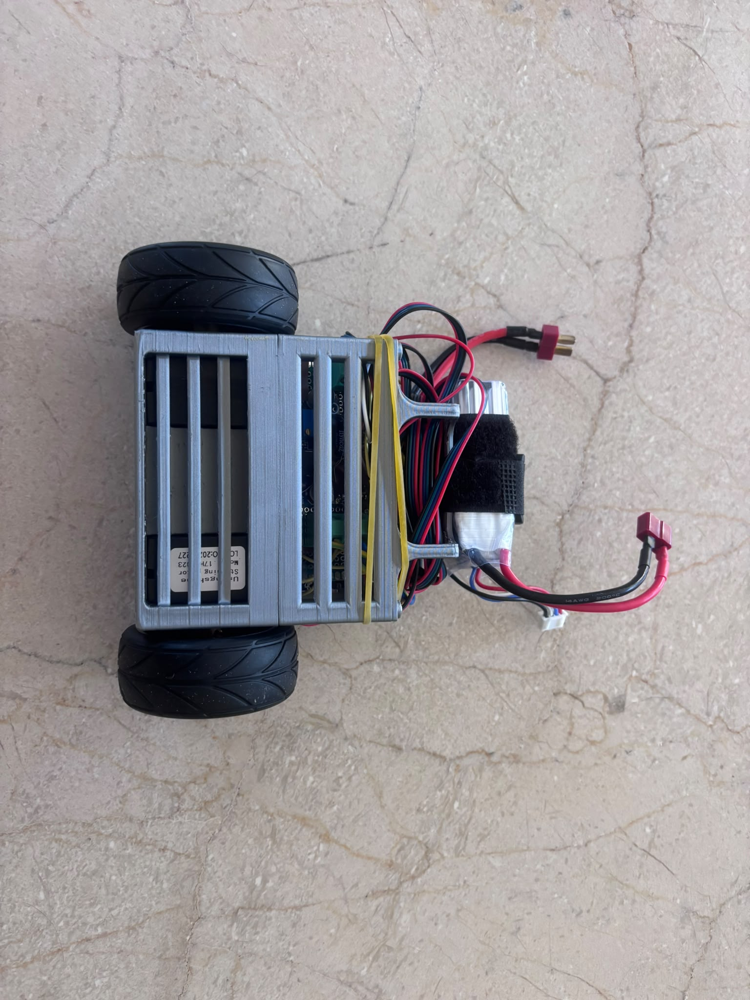
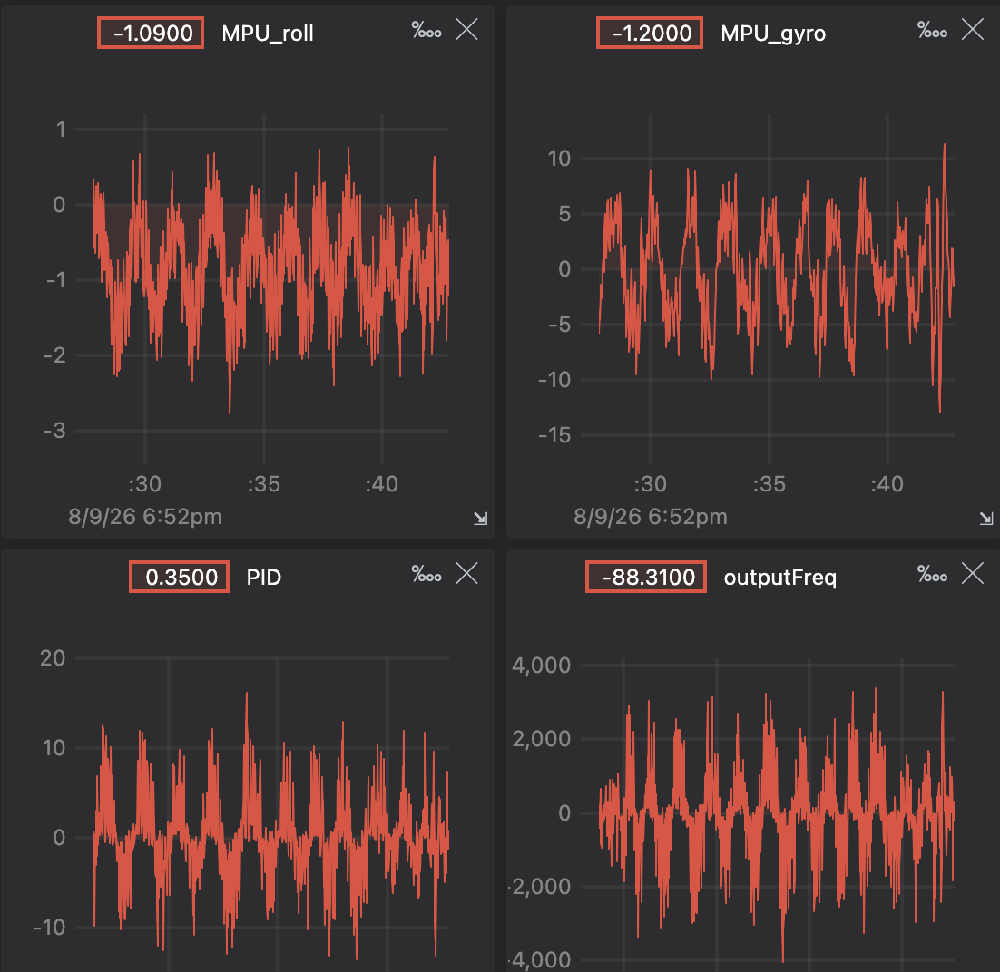
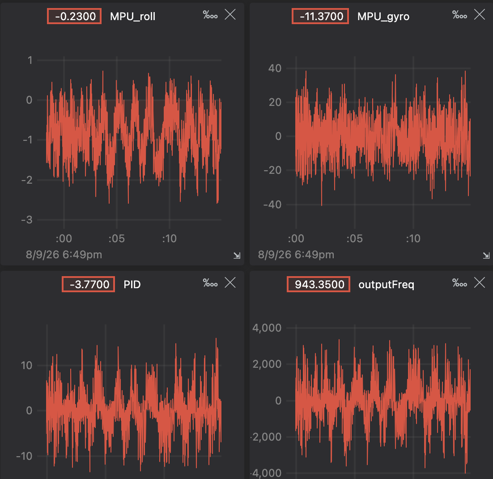

# ESP32-self-balancing-robot
A self-balancing, two-wheeled robot built from scratch using an ESP32 microcontroller, an MPU6050 IMU, and NEMA stepper motors. Using VS code with platformio

---

## System Overview

* **Microcontroller:** ESP32
* **IMU:** MPU6050
* **Actuators:** NEMA 17 Stepper Motors
* **Drivers:** A4988 Stepper Motor Drivers
* **Power:** 12V LiPo Battery with a Buck Converter stepping down to 5V

---

## Mechanical Design & 3D Printing

The chassis was designed from scratch using **Fusion 360**. Key design considerations include:

* **Thermal Management:** Cutouts and ventilation paths were integrated into the motor mounts to cool down the steppers.
* **Material Selection:** 
  * **Base Level:** Strongly recommended to print in **PETG** due to thermal output from the stepper motors. *(Printed in PLA for this build due to material availability, but PETG is advised).*
  * **Upper Levels:** Printed in **PLA** for flexibility and lower weight.

---

## Hardware & Assembly

* **Assembly Method:** Point-to-point hand soldering on perfboard.
* **Note for Builders:** Hand wiring in a tight self-balancing chassis increases noise and risk of loose connections. **Designing a custom PCB is strongly recommended**.

---

## Software & Engineering Challenges

### 1. Inverted IMU & Acceleration Glitches
* **Problem:** The robot reacted erratically with severe lag. Debugging sensor outputs revealed that pitch readings were corrupting under high acceleration due to the MPU6050 being physically mounted inverted.
* **Solution:** Constrained by the mechanical layout, I implemented a **custom Complementary Filter** and manually negating the gyroscope axis sign to restore accurate pitch tracking.

### 2. Custom Timer ISR vs. Stepper Library
* **Initial Approach:** Wrote a bare-metal timer Interrupt Service Routine (ISR) to drive step pulses directly.
* **Trade-off:** While functional and making the motor's data easily trackable, the raw ISR lacked smooth acceleration profiles required to prevent motor stall. 
* **Current State:** Migrated to an established stepper library for dynamic step timing. The original custom ISR code is retained in the repository (`custom_isr_driver/self_prot.cpp`) for reference.

### 3. Mechanical Vibrations & LPF Latency Trade-off
Stepper motor steps generate high-frequency mechanical noise that propagates into the MPU6050, introducing jitter into pitch calculations.

* **Filter Experimentation:** Implemented a software Low-Pass Filter (LPF) to dampen sensor noise.
* **The Trade-off (Phase Lag):** While the LPF slightly softened raw signal spikes, it introduced phase delay (latency) into the feedback loop. For a fast-responding self-balancing system, this delay reduced PID responsiveness and compromised recovery time.
* **Takeaway:** Digital filtering alone proved insufficient due to the latency constraint. Future iterations require hardware-level fixes, maybe vibration dampeners under the IMU or transitioning to a rigid custom PCB.

With LPF:

Without LPF:

---

## Video

Check out the robot in action:

  

---

## Future Roadmap

- [ ] **Remote Control Integration:** Implement wireless control via Wi-Fi (ESP-NOW) or Bluetooth.
- [ ] **Directional Movement:** Translate target tilt angles to move forward/backward.
- [ ] **Yaw Control:** Implement differential motor driving for steering capabilities.
